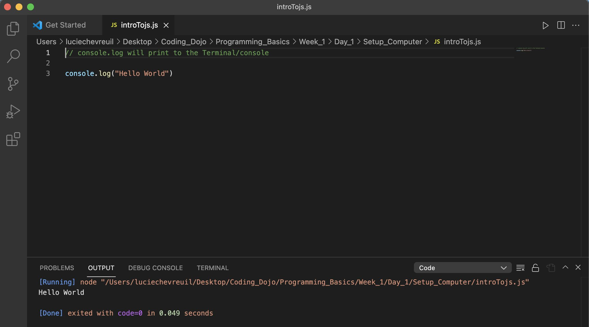

# Day 1
Hello World!

Today was Day 1 of a 3-stack coding bootcamp. Prior to today, I had written maybe 10 lines of code, and I barely understood what they were accomplishing. I had attempted two online community college classes about coding, and failed both. I also tried self-teaching 6 months ago, and found few results.

This time around, I am motivated, I have time, I have a support system and I am in a program that matches my learning style.

I also have a lot on the line. After I was let go from my position at Coinbase, I have been applying to jobs with few results. It’s been a risk (worth taking, I should add) to pivot going back to class full-time, and leverage my savings to pay for tuition and my living expenses.

Today was a great first day of class. My cohort is lively, and my professors are engaging and funny people. I am already amazed by my ability to absorb the material, and this single line of Javascript code was a fist-pump-in-the-air kind of moment.

Hello World, my name is Lucie, and I am excited to begin this next chapter!

#coinbase18 #womenwhocode #codingbootcamp #coding #javascript

