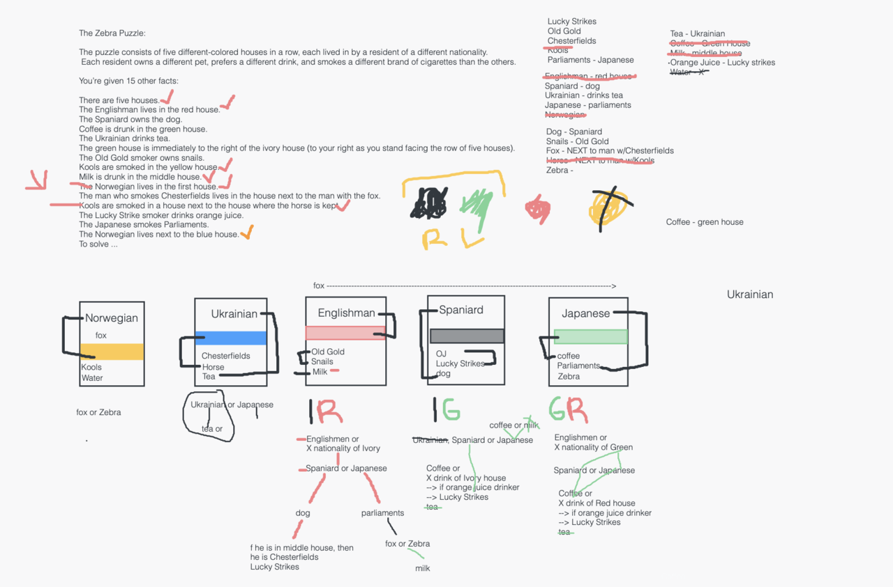

# Day 4
A Day 4 update from my Coding Journey!

(It's also the end of the first week of coding bootcamp!)

We started the day working on the following puzzle, which my group of 3 classmates took about 90 minutes to solve. Anyone want to give it a shot? Also please enjoy this photo I took of where I decided to log into class today!

The Zebra Puzzle:

The puzzle consists of five different-colored houses in a row, each lived in by a resident of a different nationality. Each resident owns a different pet, prefers a different drink, and smokes a different brand of cigarettes than the others.

You’re given 15 other facts:
There are five houses.
The Englishman lives in the red house.
The Spaniard owns the dog.
Coffee is drunk in the green house.
The Ukrainian drinks tea.
The green house is immediately to the right of the ivory house (to your right as you stand facing the row of five houses).
The Old Gold smoker owns snails.
Kools are smoked in the yellow house.
Milk is drunk in the middle house.
The Norwegian lives in the first house.
The man who smokes Chesterfields lives in the house next to the man with the fox.
Kools are smoked in a house next to the house where the horse is kept.
The Lucky Strike smoker drinks orange juice.
The Japanese smokes Parliaments.
The Norwegian lives next to the blue house.
To solve the puzzle, tell me:

1) Which man likes to drink water?
2) Which man owns a zebra?

#codingbootcamp #womenwhocode #coding #javascript #coinbase18

Comment: The following is a screenshot of the whiteboard my group collaborated on in Zoom! Beware, the answer is inside!

